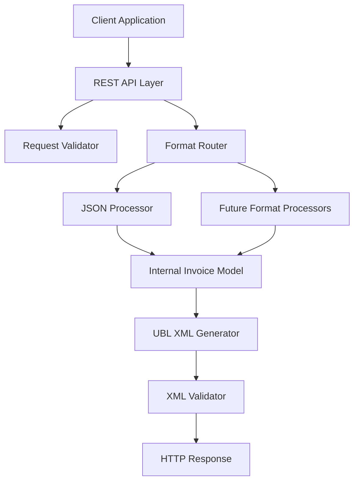

# Design Document

## Overview

The Invoice Conversion API is a REST service that transforms invoice data from various input formats into standardized UBL 2.1 XML format. The system uses a modular architecture with pluggable input processors, a common internal data model, and a robust UBL XML generator. The API is designed for high reliability, extensibility, and ease of integration.

## Architecture

### High-Level Architecture



### Core Components

1. **REST API Layer**: Handles HTTP requests, routing, and response formatting
2. **Request Validator**: Validates input parameters and payload structure
3. **Format Router**: Determines appropriate processor based on input type
4. **Input Processors**: Format-specific converters (JSON, future PDF, etc.)
5. **Internal Invoice Model**: Common data structure for all invoice formats
6. **UBL XML Generator**: Converts internal model to valid UBL 2.1 XML
7. **XML Validator**: Ensures generated XML meets UBL schema requirements

## Components and Interfaces

### REST API Endpoints

#### POST /api/v1/convert
**Purpose**: Convert invoice from input format to UBL XML

**Request Body**:
```json
{
  "invoiceType": "json",
  "outputFormat": "UBL XML",
  "invoiceData": { /* invoice payload */ }
}
```

**Response**:
```json
{
  "success": true,
  "outputFormat": "UBL XML",
  "convertedInvoice": "<Invoice xmlns=\"urn:oasis:names:specification:ubl:schema:xsd:Invoice-2\">...</Invoice>",
  "metadata": {
    "conversionTimestamp": "2024-01-15T10:30:00Z",
    "inputFormat": "json",
    "ublVersion": "2.1"
  }
}
```

#### GET /api/v1/formats
**Purpose**: List supported input and output formats

**Response**:
```json
{
  "inputFormats": ["json"],
  "outputFormats": ["UBL XML"],
  "futureFormats": ["pdf", "csv"]
}
```

### Input Processor Interface

```typescript
interface InputProcessor {
  canProcess(invoiceType: string): boolean;
  process(invoiceData: any): InternalInvoiceModel;
  validate(invoiceData: any): ValidationResult;
}
```

### JSON Processor Implementation

The JSON processor will handle two main JSON formats:
1. **UBL-specific JSON**: Contains UBL namespace references (_D, _A, _B) and structured arrays
2. **Generic JSON**: Standard invoice fields without UBL-specific structure

**Processing Logic**:
- Detect JSON format type based on presence of UBL namespace keys
- Map fields to internal model using format-specific mapping rules
- Handle nested structures and arrays appropriately
- Preserve currency codes and monetary values with precision

## Data Models

### Internal Invoice Model

```typescript
interface InternalInvoiceModel {
  // Basic Invoice Information
  id: string;
  issueDate: string;
  invoiceTypeCode?: string;
  documentCurrencyCode: string;
  
  // Parties
  supplierParty: Party;
  customerParty: Party;
  payeeParty?: Party;
  
  // Invoice Period
  invoicePeriod?: {
    startDate?: string;
    endDate?: string;
  };
  
  // Monetary Totals
  legalMonetaryTotal: {
    lineExtensionAmount: MonetaryAmount;
    taxExclusiveAmount?: MonetaryAmount;
    taxInclusiveAmount?: MonetaryAmount;
    payableAmount: MonetaryAmount;
  };
  
  // Invoice Lines
  invoiceLines: InvoiceLine[];
  
  // Tax Information
  taxTotal?: TaxTotal[];
  
  // Additional Information
  notes?: Note[];
  paymentMeans?: PaymentMeans[];
  allowanceCharges?: AllowanceCharge[];
}

interface Party {
  partyName: string;
  partyIdentification?: string;
  postalAddress?: PostalAddress;
  contact?: Contact;
  partyTaxScheme?: PartyTaxScheme;
  partyLegalEntity?: PartyLegalEntity;
}

interface InvoiceLine {
  id: string;
  invoicedQuantity: Quantity;
  lineExtensionAmount: MonetaryAmount;
  item: Item;
  price: Price;
  taxTotal?: TaxTotal;
  note?: string;
}

interface MonetaryAmount {
  value: number;
  currencyID: string;
}
```

### UBL XML Generator

The UBL XML generator will:
- Transform internal model to UBL 2.1 XML structure
- Apply proper UBL namespaces (Invoice-2, CommonAggregateComponents-2, CommonBasicComponents-2)
- Ensure required elements are present with defaults if needed
- Maintain proper XML structure and element ordering per UBL specification
- Handle currency formatting and decimal precision
- Generate valid XML that passes UBL schema validation

## Error Handling

### Error Response Format

```json
{
  "success": false,
  "error": {
    "code": "INVALID_INPUT_FORMAT",
    "message": "Unsupported invoice type: pdf",
    "details": {
      "supportedFormats": ["json"],
      "receivedFormat": "pdf"
    }
  },
  "timestamp": "2024-01-15T10:30:00Z"
}
```

### Error Categories

1. **Validation Errors (400)**:
   - Invalid input format
   - Missing required parameters
   - Malformed JSON payload
   - Invalid currency codes

2. **Processing Errors (422)**:
   - Unable to map required UBL fields
   - Invalid monetary calculations
   - Missing critical invoice data

3. **System Errors (500)**:
   - XML generation failures
   - Internal processing errors
   - Database connection issues

## Testing Strategy

### Unit Testing
- Test each input processor independently
- Validate internal model transformations
- Test UBL XML generation with various input scenarios
- Test error handling for edge cases

### Integration Testing
- End-to-end API testing with sample invoices
- Test with both UBL-specific and generic JSON formats
- Validate generated XML against UBL 2.1 schema
- Test error responses and status codes

### Test Data
- Use provided sample files as test cases
- Create additional test cases for edge scenarios
- Test with missing optional fields
- Test with invalid data to verify error handling

### Performance Testing
- Load testing with concurrent conversion requests
- Memory usage testing with large invoice files
- Response time benchmarking

## Security Considerations

- Input validation to prevent injection attacks
- Request size limits to prevent DoS attacks
- Rate limiting for API endpoints
- Sanitization of XML output
- Logging of conversion requests for audit trails

## Deployment Architecture

The service will be containerized and can be deployed as:
- Standalone microservice
- Part of larger invoice processing system
- Cloud-native service with auto-scaling capabilities

## Future Extensibility

The modular design supports:
- Additional input format processors (PDF, CSV, EDI)
- Multiple output formats (JSON, CSV, other XML standards)
- Enhanced validation rules
- Custom field mapping configurations
- Integration with external validation services